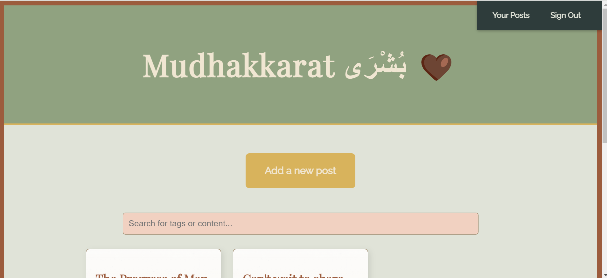

# Mudakkarat - Your Personal Diary

Mudakkarat is a simple, private, and secure journaling app where you can document your thoughts, experiences, and emotions. It’s not just an app—it's your personal space to capture moments, reflect on your day, and keep memories safe and organized.

## Features

- **Private by Default**: Your journal entries are private and secure.
- **Easy to Use**: A simple and intuitive interface that lets you quickly capture your thoughts and memories.
- **Tagging System**: Organize entries with tags like "travel," "work," or "personal" for easy searching.
- **Mood Tracking**: Record your emotions alongside your journal entries to capture your state of mind over time.
- **Image Support**: Add images to your entries to accompany your words and enhance your memories.

## Screenshots


*Image showcasing the main page with journal entries.*

## Installation

1. Clone this repository:
    ```bash
    git clone https://github.com/yourusername/mudakkarat.git
    ```

2. Navigate to the project directory:
    ```bash
    cd mudakkarat
    ```

3. Install dependencies:
    ```bash
    npm install
    ```

4. Run the app:
    ```bash
    npm start
    ```

5. Visit `http://localhost:3000` in your browser to access the app.

## Technologies Used

- **Node.js** for the backend
- **Express** for server routing
- **MongoDB** for database storage
- **EJS** for rendering dynamic HTML
- **CSS (with Flexbox)** for responsive design
- **Google Fonts** for typography

## Attributions 

ChatGPT: Used in several ways, such as assisting in organizing and preparing the journal app.

## Planning Tools
Google Docs: https://docs.google.com/document/d/1ePugdlxV6EM8o2Ydk2pMLtV_1zTi7-cLlHS5JobHiBk/edit?usp=sharing
ChatGPT: Helping me while creating the pseudocode.


## Future Features: Next Steps for Mudakkarat
- **Shared View** 

Users can post entries to a shared view visible to others.
Users can follow people by sharing a unique key or code.
Allows interaction with other users' posts while maintaining control over who can view them.
Private View:

- **Private View:** 
A secure, personal space for users to keep their entries private.
Only the user who created the entry can view it.


- **Shared Key for Following::** 
Users exchange a unique key to follow others and access shared entries.
Provides a more controlled and trusted way to connect with others.


- **Post to Shared or Private View::** 
Users can choose whether an entry is for their private view or for sharing in the shared view.
Entries for the shared view are accessible only to users with the shared key.